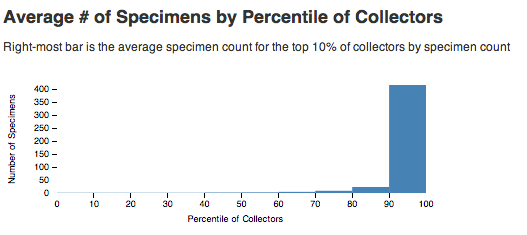

# Botany Collector Analysis

This application is part of ongoing research looking at making digital collections of museums, archives and libraries more accessible and streamlining online research.

If we can connect archival material and specimens across collections through the people who created the works or collected the specimens, we believe the resulting data will be interesting to the public and potentially yield new research insights for historians. In this context, we define “interesting” as data that yields links to other artifacts, specimens, archival papers, historical writings or biographical information.  Based on interviews with researchers, we believe that these kinds of links will yield new research insights, because they are digital recreations of patterns that researchers traditionally follow in the physical world.

## Hypothesis: Number of Specimens Correlates with Notability
We have a hypothesis that for some threshold of # of specimens, a botanist has a high probability of being found elsewhere.  For example, the botanist may have published books or papers, may have field notebooks in an archive, or biographies may have been written about the scientist.




The data is from the Smithsonian National Museum of Natural History (NMNH) [Botany collection](http://botany.si.edu/). [Terms of Use](http://www.si.edu/Termsofuse)

## Build

```
bundle
rake db:create
rake db:migrate
rake import:collectors
rails s
```

point your browser to: http://localhost:3000


